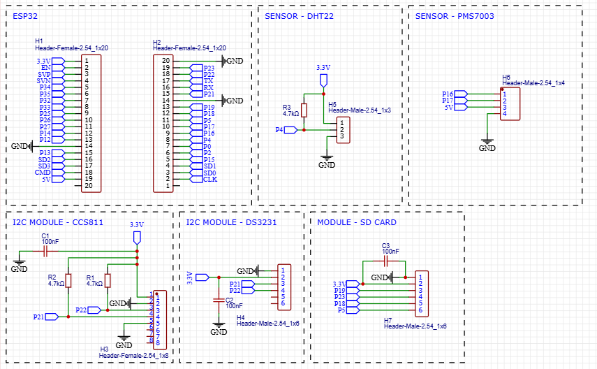
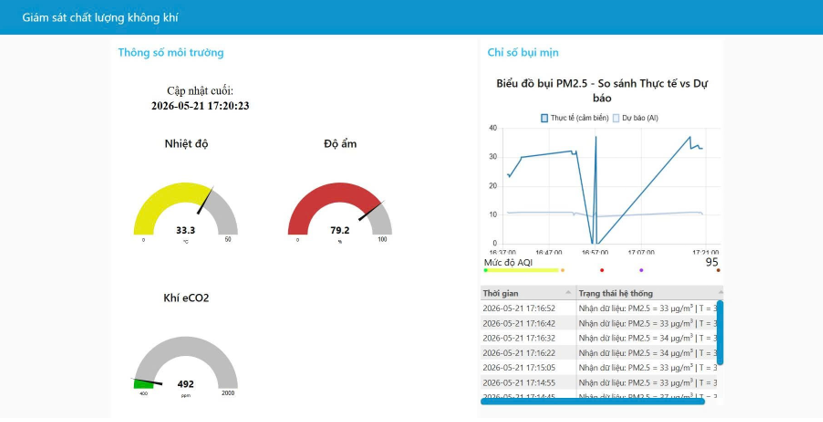
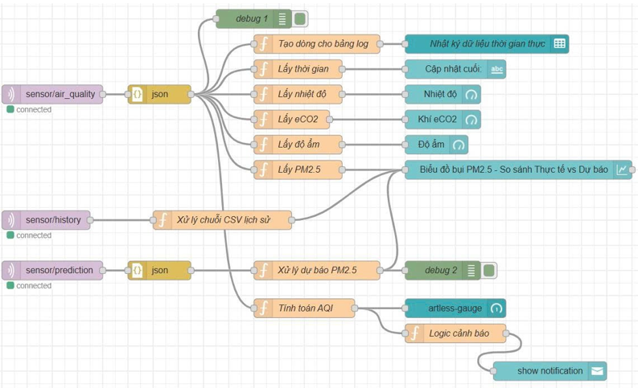

# Air-Quality-Monitoring-System
An IoT-based air quality monitoring system using ESP32, MQTT, Node-RED, and AI prediction.

---

## Overview

This project collects environmental data from multiple sensors and visualizes them in real time through a Node-RED dashboard.

The system also includes a basic AI model for short-term air quality prediction.

---

## Hardware

- ESP32
- PMS7003
- CCS811
- DHT22
- RTC Module
- SD Card Module

---

## Technologies

- C/C++
- MQTT
- Node-RED
- Python
- Git

---

## System Architecture



---

## Features

- Real-time air quality monitoring
- MQTT communication
- Data logging using RTC and SD Card
- Node-RED dashboard visualization
- Air quality prediction using AI

---

## Dashboard



---

## Hardware Prototype



---

## Repository Structure

```text
firmware/
node-red/
ai/
docs/
images/
```

---

## Author

Huynh Cong Vinh